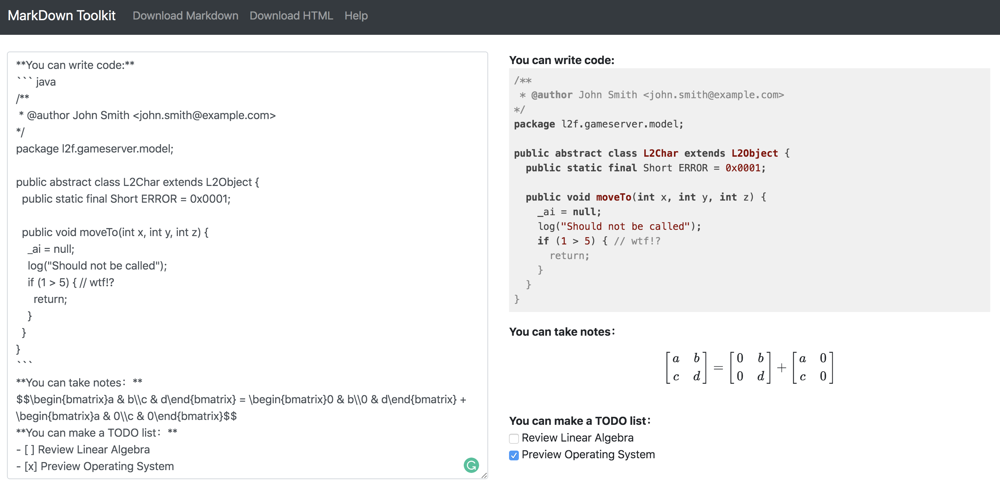
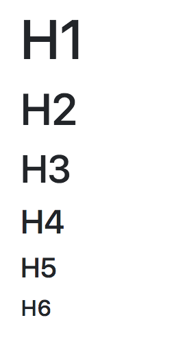
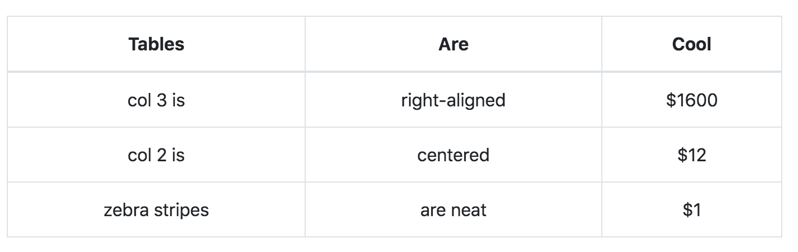
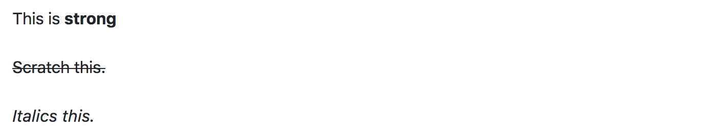
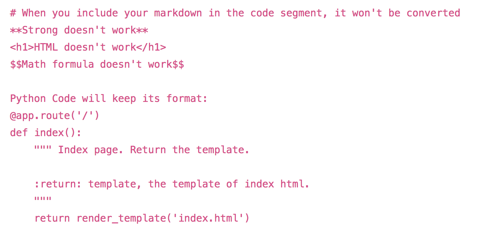
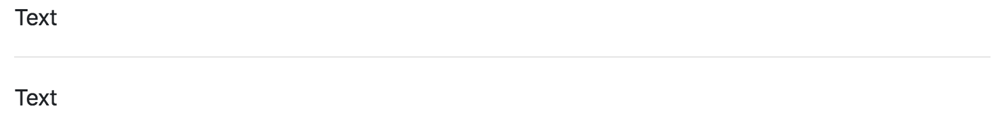
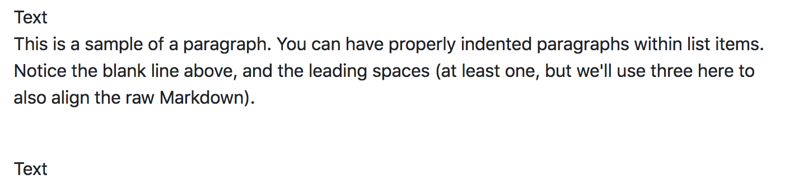
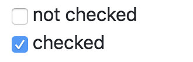
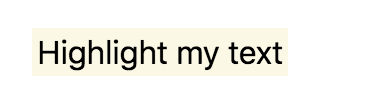

Welcome to **Markdown Toolkit**! Markdown Toolkit is an application to convert Markdown to different types of files such as HTML and PDF.


[Here](http://yzhu.pythonanywhere.com/) is a sample web application of Markdown Toolkit.




## Table of contents

- [Do you want a new feature?](#Do-you-want-a-new-feature)
- [Feature List](#feature-lists)
- [Download](#cloning-the-repo)
- [Environment Setup](#set-up-the-environment)
- [Run Code](#run-the-program)
- [Syntax Support](#syntax-supported)
    * [Header](#header)
    * [Math](#math-formula)
    * [Code](#code)
        * [Code Segment](#code-segment)
    * [Tables](#tables)
    * [Insert image](#image)
    * [Insert link](#link)
    * [Strong, italics, and scratch](#strong-italics-and-scratch)
    * [Horizontal Rule](#horizontal-rule)
    * [Unordered List](#unordered-list)
    * [Ordered List](#ordered-list)
    * [Paragraph](#paragraph)
    * [Checkbox](#checkbox)
    * [Highlight](#highlight)
    * [Block quote](#block-quote)
- [Support Pacakages](#packages)

## Do you want a new feature
If you want a new feature, you can open an issue in this github repository. If you want to contribute to this repository, you are welcome to do so!

## Cloning the repo
```
git clone https://github.com/zhu-y/markdown-toolkit.git
```

## Set up the environment
```
pip install -r requirements.txt
```

## Run the program

```
python run.py
```

You can also use [Gunicorn](https://github.com/benoitc/gunicorn) to run the program:
With default number of workers:
```
sh gunicorn.sh
```

You can also change the number of workers as you want:
```
gunicorn -w [number of workers] -b [host]:[port] app:app
```
For example, if you want four workers, 127.0.0.1 as host, 4000 as port:
```
gunicorn -w 4 -b 127.0.0.1:4000 app:app
```


## Feature Lists

### Completed
- Headers
- Horizontal Rule
- Unordered List
- Ordered List
- Paragraph
- Strong, Scratch, and Italics
- Images
- Links(in markdown file/websites)
- Code Segment/Inline Code
- MathJax Support
- Download as Markdown/HTML
- Local Storage
- Checkbox
- Highlight Text
- Upload Markdown File
- Code Highlight
- Table

### To do
- Workflow
- Download as PDF
- Convert HTML to Markdown
- Login
- Save Notes into User's Private Notebook


## Syntax supported

### Header

Markdown:
```
# H1
## H2
### H3
#### H4
##### H5
###### H6
```

Result:




### Math formula
More syntax about MathJax please refer [Here](https://math.meta.stackexchange.com/questions/5020/mathjax-basic-tutorial-and-quick-reference).

#### Math formula itself as a line
Markdown:
```
$$S_{j,k} = L - \sum_{i=j}^{k-1}(c_i + 1)-C_k$$$$\sum_{i=0}^n i^2 = \frac{(n^2+n)(2n+1)}{6}$$
```

Result:


#### inline math formula
Markdown:
```
$\begin{bmatrix}a & b\\c & d\end{bmatrix}$
```

Result:


### Tables
You can insert a table by coding:
```
| Tables        | Are           | Cool  |
| ------------- |:-------------:|-----:|
| col 3 is      | right-aligned | $1600 |
| col 2 is      | centered      |   $12 |
| zebra stripes | are neat      |    $1 |
```
The result will be:


### Strong, Italics, and Scratch

Markdown:
```
This is **strong**

~~Scratch this.~~

__Italics this.__
```
Result:


### Image

#### Online Source
If you want to insert an image from online source, include your image address in the parentheses. For example, if you want to include the logo of google in your markdown, you can write:

Markdown:
```

```

Result:


#### Local Source

If you want to insert an image from the same path, include the path in the parentheses. Here is an example:

Markdown:
```

```

Result:


#### Scale

When the image is too large or too small, you can scale the image by adding '#[scale number]' to the end of the image link.

For example, if you originally insert image by coding:
```

```
And you want to scale it, you can use:
```


```
And you can see the result as following:


### Link

Markdown:
```
[Markdown Toolkit Github Repo](https://github.com/zhu-y/markdown-toolkit)
```

Result:
[Markdown Toolkit Github Repo](https://github.com/zhu-y/markdown-toolkit)

### Code

#### Code Segment

Markdown(Python code)
``` python
def foo():
    pass
```

Markdown(C++ code)
``` cpp
#include<iostream>
using namespace std;

int main(){
    cout << "Hello World";
}
```

Result:



### Horizontal Rule

Markdown:
```
Text
---
Text
```

Result:


### Paragraph

Markdown:
```
Text
⋅⋅⋅This is a sample of a paragraph. You can have properly indented paragraphs within list items. Notice the blank line above, and the leading spaces (at least one, but we'll use three here to also align the raw Markdown).
Text
```

Result:


### Ordered List

Markdown:
```
1. First Line
1. Second Line
1. Third Line
```

Result:


### Unordered List

Markdown:
```
- First Level 1
    * Second Level 1
    - Second Level 2
        - Third Level
    - Second Level 3
+ First Level 2
```
Result:


### Checkbox

Markdown:
```
- [ ] not checked
- [x] checked
```
Result:



#### Highlight

Markdown:
```
##Highlight my text##
```

Result:



### Block quote

Markdown:
```
> This is a blockquote
This is the normal text.
```

Result:


## Packages
- Math Support: [MathJax](https://www.mathjax.org/)
- Frontend Support: [Bootstrap](https://getbootstrap.com/)
- Backend: [Flask](http://flask.pocoo.org/)

To do:
- Code highlight support: [highlight.js](https://github.com/highlightjs/highlight.js)


