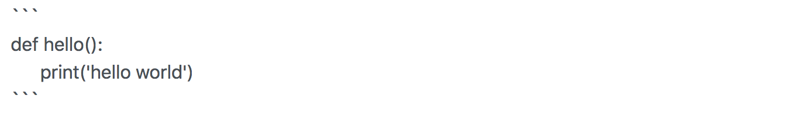
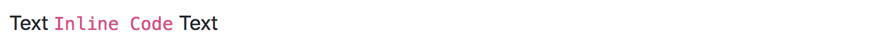

# Syntax supported

## Header

Markdown:
```
# H1
## H2
### H3
#### H4
##### H5
###### H6
```

Result:


## Math formula
More syntax about MathJax please refer [Here](https://math.meta.stackexchange.com/questions/5020/mathjax-basic-tutorial-and-quick-reference).

Markdown:
```
$$\sum_{i=0}^n i^2 = \frac{(n^2+n)(2n+1)}{6}$$
$\begin{bmatrix}a & b\\c & d\end{bmatrix}$
```

Result:


## Strong, Italics, and Scratch

Markdown:
```
This is **strong**

~~Scratch this.~~

__Italics this.__
```
Result:


## Image

### Online Source
If you want to insert an image from online source, include your image address in the parentheses. For example, if you want to include the logo of google in your markdown, you can write:

Markdown:
```
/cdn.vox-cdn.com/uploads/chorus_image/image/47070706/google2.0.0.jpg)
```

Result:
/cdn.vox-cdn.com/uploads/chorus_image/image/47070706/google2.0.0.jpg)

### Local Source

If you want to insert an image from the same path, include the path in the parentheses. Here is an example:

Markdown:
```

```

Result:


## Link

Markdown:
```
[Markdown Toolkit Github Repo](https://github.com/zhu-y/markdown-toolkit)
```

Result:
[Markdown Toolkit Github Repo](https://github.com/zhu-y/markdown-toolkit)

## Code 

### Code Segment

Markdown:


Result:


### Inline Code

Markdown:
```buildoutcfg
Text `Inline Code` Text
```

Result:


## Horizontal Rule

Markdown:
```
Text
---
Text
```

Result:


## Paragraph

Markdown:
```
Text
⋅⋅⋅This is a sample of a paragraph. You can have properly indented paragraphs within list items. Notice the blank line above, and the leading spaces (at least one, but we'll use three here to also align the raw Markdown).
Text
```

Result:


## Ordered List


Markdown:
```
- First Level 1
    - Second Level 1
    - Second Level 2
        - Third Level
    - Second Level 3
- First Level 2 
```

Result:


## Unordered List

Markdown:
```
* Unordered list can use asterisks
- Or minuses
+ Or pluses
```

Result:


## Checkbox

Markdown:
```
- [ ] not checked
- [x] checked
```
Result:


## Highlight

Markdown:
```
##Highlight my text##
```

Result:


## Block quote

Markdown:
```
> This is a blockquote
This is the normal text.
```

Result:


